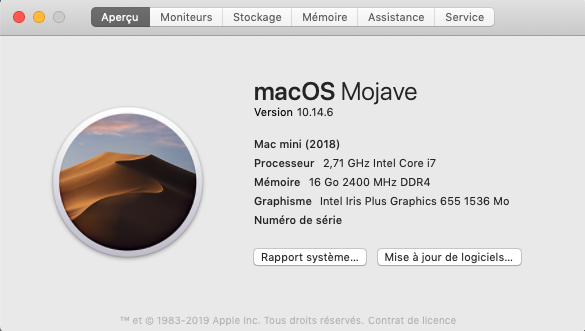

<h1 align="center">NUC8I7BEH-hackintosh</h1>
<p>
  
  
</p>

# OS-X-NUC8i7BEH-Clover
This repository contains the files to install macOS on Intel NUC8i7BEH.

Thanks for [randyzhong/OS-X-NUC8i7BEH-Clover](//github.com/rlabrecque/Steamworks.NET)



# Hardware
- CPU: Intel i7-8559U
- Graphic: Intel Iris Plus 655
- RAM: 2 x Crucial CT8G4SFS824A 8Go
- Storage : Samsung SSD 850 PRO 512GB

# Configure BIOS Settings
On my NUC8i7BEH, BIOS version updated to **0071**.

The boot menu and BIOS setup can be accessed by mashing the F2 key during BIOS startup. After the main screen comes up choose "Advanced". That gets you to the main BIOS setup screens.

To start, choose "Load Defaults" (choose from the menu or press F9 in the BIOS setup).

- Boot-> Boot Configuration, disable "Network Boot"
- Boot-> Secure Boot, "Secure Boot" is disabled
- Devices-> Video, "IGD Minimum Memory" set to 64mb or 128mb
- Devices-> Video, "IGD Aperture Size" set to 256mb

Press **F10** to save changes.

# Installation
- Follow the tutorial to [install MAC OS Mojave.](https://www.tonymacx86.com/threads/unibeast-install-macos-mojave-on-any-supported-intel-based-pc.259381)

- After installing Unibeast Step 2 replace my repository's EFI folder in the EFI folder of the usb key.

- Install MAC OS and boot to system OS.

- After installing MultiBeast Step 6 replace my repository's EFI folder in the EFI folder of the EFI Partition.

# Power Management

Everything required for CPU/IGPU power management is already installed with the steps above.
There is no longer any need to use the ssdtPRgen.sh script.

Be aware that hibernation (suspend to disk or S4 sleep) is not well supported on hackintosh.

You should disable it:
```
sudo pmset -a hibernatemode 0
sudo rm /var/vm/sleepimage
sudo mkdir /var/vm/sleepimage
```
Always check your hibernatemode after updates and disable it. System updates tend to re-enable it, although the trick above (making sleepimage a directory) tends to help.

# Tested OS

## Kexts
- AppleALC (1.4.0)
- CPUFriend.kext (1.1.9)
- IntelMausiEthernet.kext (2.5.0d0)
- Lilu.kext (1.3.8)
- SATA-unsupported (0.9.2)
- USBPorts.kext (1.0)
- VirtualSMC.kext (1.0.7)
- WhateverGreen.kext (1.3.1)

## Works
- UEFI booting via Clover
- DP/HDMI video/audio
- Native USB3/USB2
- Native audio with AppleHDA
- Native power management
- GPU Hardware Acceleration
- Wired Ethernet
- Mac App Store working
- Sleep (hibernation disabled)
- Dual Displays (1 HDMI, 1 USB-C to DP)

# License
[Unlicense](LICENSE.txt)
